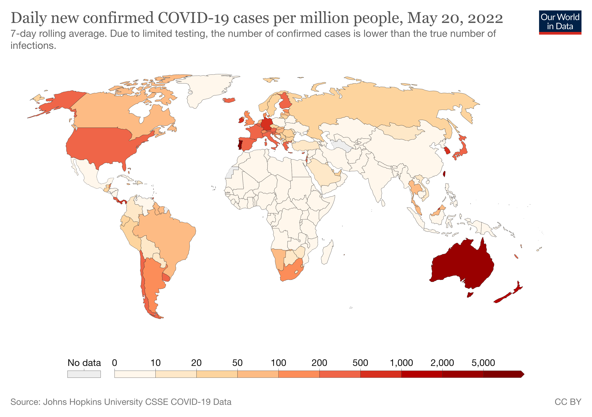
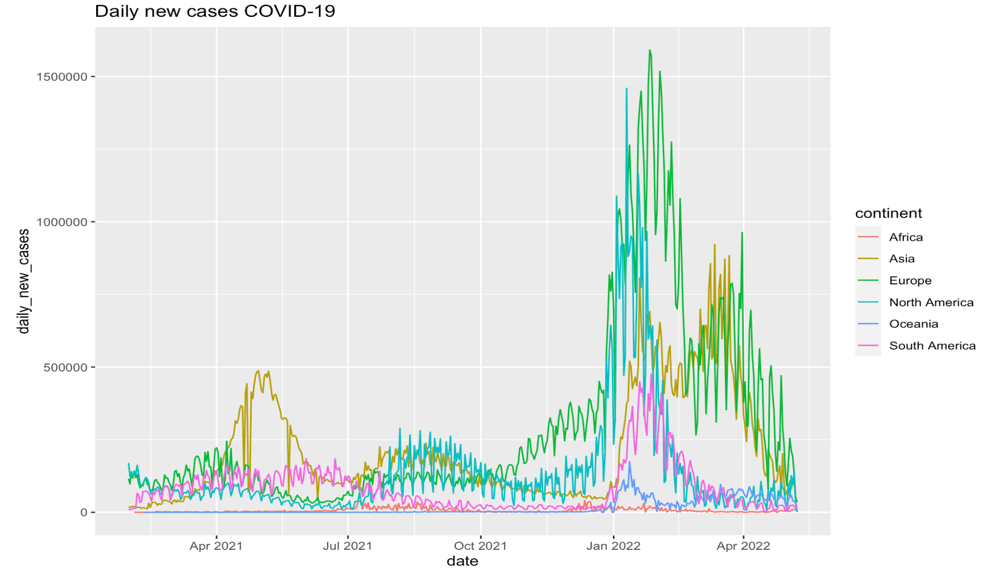
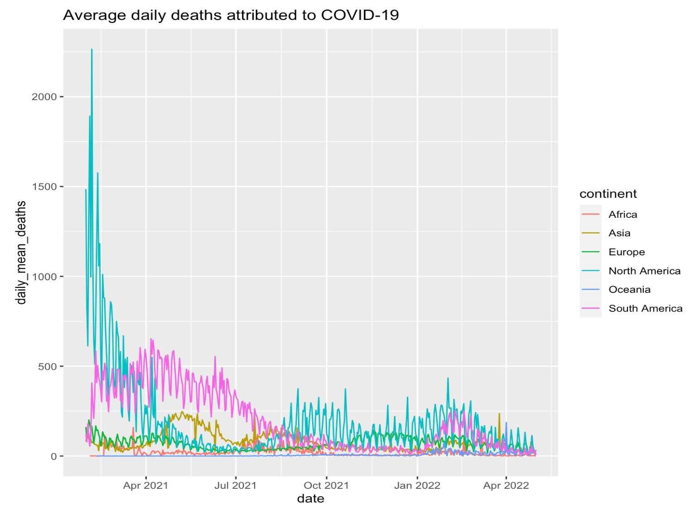
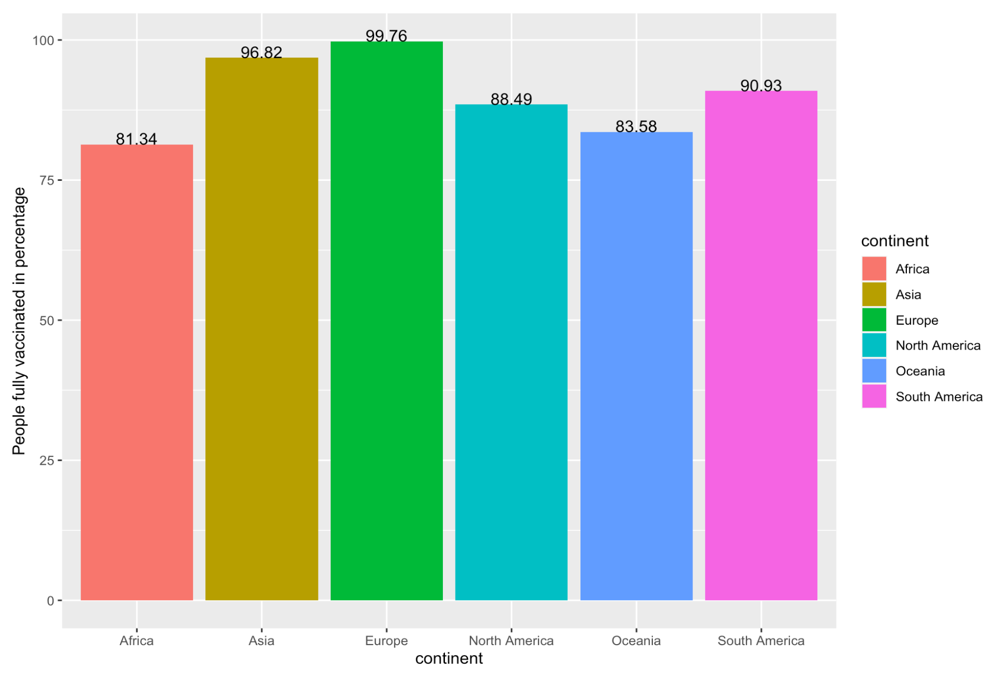
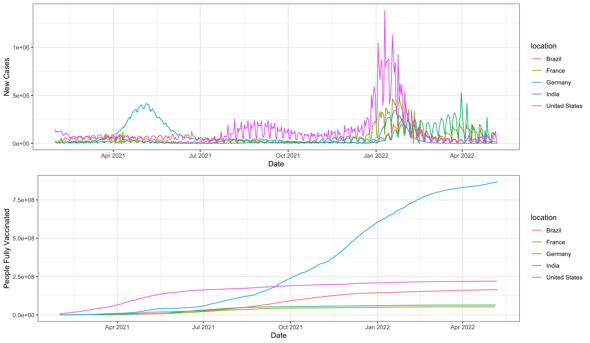
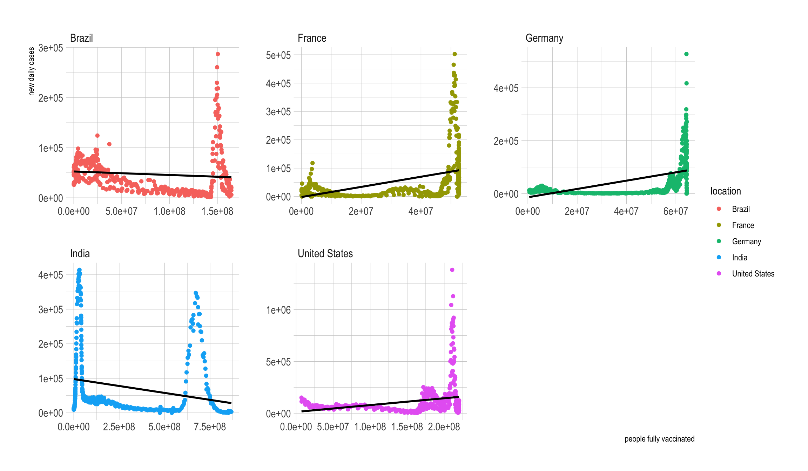
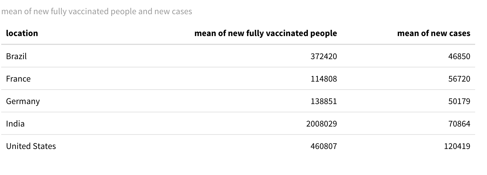

```{r setup, include=FALSE}
options(htmltools.dir.version = FALSE)
```

```{r , echo = FALSE, message = FALSE, warning = FALSE}
library(tidyverse)
library(palmerpenguins)
library(datasets)
```

class: left, top

# Background Introduction

- .bold[To bring this pandemic to an end, a large share of the world needs to be immune to the virus]

- .bold[The safest way to achieve this is with a vaccine]

- .bold[Vaccines are a technology that humanity has often relied on in the past to bring down the death toll of infectious diseases]

```{r out.width = '50%', echo = FALSE, fig.align="center"}
 
```
---

class: left, top

####Daily new cases COVID-19 by region

```{r out.width = '100%', echo = FALSE, fig.align="center"}
 
```
- .content-box-soft[Three times breakout over this period]
- .content-box-soft[Europe always has the highest daily cases]

---

class: left, top

####COVID-19 Average daily deaths 


```{r out.width = '100%', echo = FALSE, fig.align="center"}

```


---


###COVID-19 People fully-vaccinated rate by region


```{r out.width = '100%', echo = FALSE, fig.align="center"}


```

---

class: left, top

##Research Questions:

.content-box-duke-green[ 
- .bold[Effects of government policies on the spread of COVID-19 worldwide]
]

.content-box-duke-green[ 
- .bold[How do positive cases change relate to vaccination?] 
] 

.content-box-duke-green[ 
- .bold[How do death rates from COVID-19 differ between people who are vaccinated and those who are not?]
]

---
class: left, top

### Trend of news cases and people fully vaccinated

.pull-center[
```{r out.width = '80%', fig.align = "center", echo = FALSE}

```
]

- .content-box-soft[New cases in United states boosted in Jan 2022 but not as boosted as their vaccination.]
- .content-box-soft[India did the best in vaccination and other countries stays regular.]
---
class: left,top

.pull-top[ 
###How new cases .bold[correlated] with number of people fully vaccinated

] 

```{r out.width = '100%', fig.align = "center", echo = FALSE}

```


- .content-box-soft[no significant linear relationship between vaccination and cases.]

---
class: left, top
.pull-top[ 
### Mean value of new cases and daily new fully vaccinated people

] 


.pull-middle[
```{r out.width = '100%',fig.align = "center", echo = FALSE}

```
]

.pull-bottom[
- .content-box-soft[India has highest daily new fully vaccinated people ]
- .content-box-soft[United States has highest daily new cases ]
]
---

```{r endslide, child="EndSlide/endslide.Rmd"}
```  

