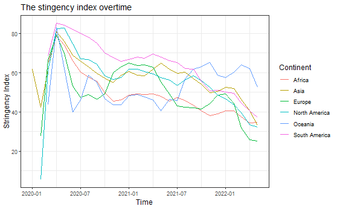
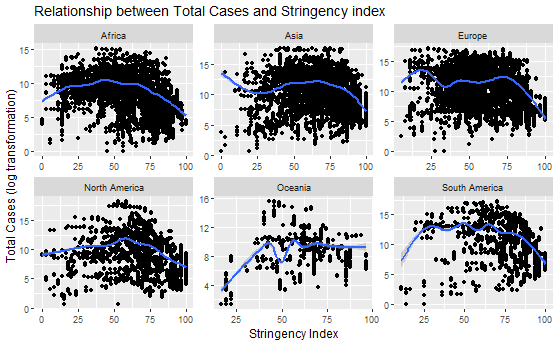

```{r setup, include=FALSE}
options(htmltools.dir.version = FALSE)
```

```{r , echo = FALSE, message = FALSE, warning = FALSE}
library(tidyverse)
library(palmerpenguins)
library(datasets)
```


# Stringency Index

- .red[The higher score indicates a stricter response (i.e. 100 = strictest response)]

- Average of school closures; workplace closures; cancellation of public events; restrictions on public gatherings; 
  closures of public transport; stay-at-home requirements; public information campaigns; restrictions on internal movements; 
  and international travel controls.

---

### Stringency Index


```{r out.width = '80%', echo = FALSE}

```


- Each continent has a response to COVID-19 at a difference time (WHO declared outbreak, first identified in China)
- A spike in 2020-04 (WHO declared COVID-19 as pandemic on 11 March)

---

```{r out.width = '50%', echo = FALSE}

```

- Non-linear relationship (it take times for the response to have an affect)

---

```{r endslide, child="EndSlide/endslide.Rmd"}
```  

