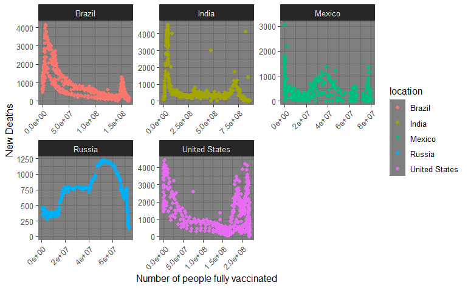

---
title: "Project presentation"
subtitle: "presentation"
author: "Krisanat Anukarnsakulchularp,
             Kumar Vatsal,
             Xiyun Zhou,
             Xinyu Hu"
            
institute: "Department of Econometrics and Business Statistics"
output:
  xaringan::moon_reader:
    lib_dir: libs
    css: css/style.css
    yolo: FALSE
---


```{r setup, include=FALSE}
options(htmltools.dir.version = FALSE)
```

```{r , echo = FALSE, message = FALSE, warning = FALSE}
library(tidyverse)
library(datasets)
library(knitr)
library(kableExtra)
library(bookdown)
```


class: center, middle

```{r message=FALSE,warning=FALSE, echo=FALSE}
data <- read.csv(here::here("Data/owid-covid-data.csv"))

```


---
class: left, top

# Average daily vaccinations and deaths for the countries with highest death rates.


```{r out.width = '100%', echo = FALSE, fig.align="center"}
knitr::include_graphics("figs/table.png") 
```

---

class: left, top

###### Relationship between new deaths and vaccination status

```{r out.width = '100%', echo = FALSE, fig.align="center"}
 
```

- .content-box-soft[We can see from the above figures that vaccinations have a clear effect on the death rate. ]


