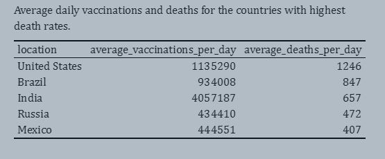

```{r setup, include=FALSE}
options(htmltools.dir.version = FALSE)
```

```{r , echo = FALSE, message = FALSE, warning = FALSE}
library(tidyverse)
library(datasets)
library(knitr)
library(kableExtra)
library(bookdown)
```


class: left, top

## Background Introduction

- .bold[To bring this pandemic to an end, a large share of the world needs to be immune to the virus]

- .bold[The safest way to achieve this is with a vaccine]

- .bold[Vaccines are a technology that humanity has often relied on in the past to bring down the death toll of infectious diseases]

```{r out.width = '50%', echo = FALSE, fig.align="center"}
knitr::include_graphics("figs/coronavirus-data-explorer.png") 
```

---

class: left, top

## Daily new cases COVID-19

- .content-box-soft[Three times breakout over the period]

- .content-box-soft[Europe always has the highest daily cases]

```{r out.width = '90%', echo = FALSE, fig.align="center"}
knitr::include_graphics("figs/sum_daily-cases.png") 
```

---

class: left, top

## COVID-19 Daily deaths 

```{r out.width = '95%', echo = FALSE, fig.align="center"}

```


---

class: left, top

## COVID-19 Vaccination rate

```{r out.width = '100%', echo = FALSE, fig.align="center"}
knitr::include_graphics("figs/barplot.png")

```

---

class: left, top

## Research Questions:

.content-box-duke-green[ 
- .bold[Effects of government policies on the spread of COVID-19 worldwide]
]

.content-box-duke-green[ 
- .bold[How do positive cases change relate to vaccination?] 
] 

.content-box-duke-green[ 
- .bold[How do death rates from COVID-19 differ between people who are vaccinated and those who are not?]
]

---

class: left, top

## Stringency Index

- Before the availability of the vaccination, the most commons measures against the COVID-19 is the use of restriction

- .red[The higher score indicates a stricter response (i.e. 100 = strictest response)]

- Average of school closures; workplace closures; cancellation of public events; restrictions on public gatherings; 
  closures of public transport; stay-at-home requirements; public information campaigns; restrictions on internal movements; 
  and international travel controls.

---

class: left, top

## Stringency Index

- .content-box-soft[Each continent has a response to COVID-19 at a different time (first identified in China, WHO declared an outbreak)]

- .content-box-soft[A spike in 2020-04 (WHO declared COVID-19 as a pandemic on 11 March)]

```{r out.width = '75%', echo = FALSE, fig.align = "center"}

```

---

class: left, top

## Government policies

- .content-box-soft[Non-linear relationship (it takes time for the response to have an effect)]

```{r out.width = '85%', echo = FALSE, fig.align = "center"}
knitr::include_graphics("figs/relationship_totalc_si.png")
```

---

class: left, top

## The trend of new cases and Fully vaccinated person

- .content-box-soft[New cases in the United States boosted in Jan 2022 but were not as boosted as their vaccination]

- .content-box-soft[India did the best in vaccination and other countries stayed regular]

```{r out.width = '75%', fig.align = "center", echo = FALSE}

```

---

class: left,top

## How new cases .bold[correlated] with the number of people fully vaccinated

- .content-box-soft[No significant linear relationship between vaccination and cases.]

```{r out.width = '90%', fig.align = "center", echo = FALSE}
knitr::include_graphics("pre_files/figure-html/correlation-vax-case.png")
```

---

class: left, top

## Mean value of new cases and daily new fully vaccinated people

- .content-box-soft[India has the highest daily new fully vaccinated]

- .content-box-soft[The United States has the highest daily new cases]

```{r out.width = '100%',fig.align = "center", echo = FALSE}
knitr::include_graphics("pre_files/tab/mean-vax-cases.png")
```

---

class: left, top

## Average daily vaccinations and deaths for the countries with highest death rates.

```{r out.width = '100%', echo = FALSE, fig.align="center"}
 
```

---

class: left, top

## Relationship between new deaths and vaccination status

- .content-box-soft[We can see from the figures that vaccinations have a clear effect on the death rate.]

```{r out.width = '90%', echo = FALSE, fig.align="center"}
 
```

---

## Conclusion

.content-box-duke-green[
- .bold[The restriction policies can mitigate the spread of the virus. However, it does not protect us against it]

- .bold[The vaccination is the more preferable method, as it reduces the death rates]
]

---

class: center, middle

```{r out.width = '95%', echo = FALSE, fig.align="center"}
knitr::include_graphics("figs/thank-you.jpg") 
```

---

```{r endslide, child="EndSlide/endslide.Rmd"}
```


